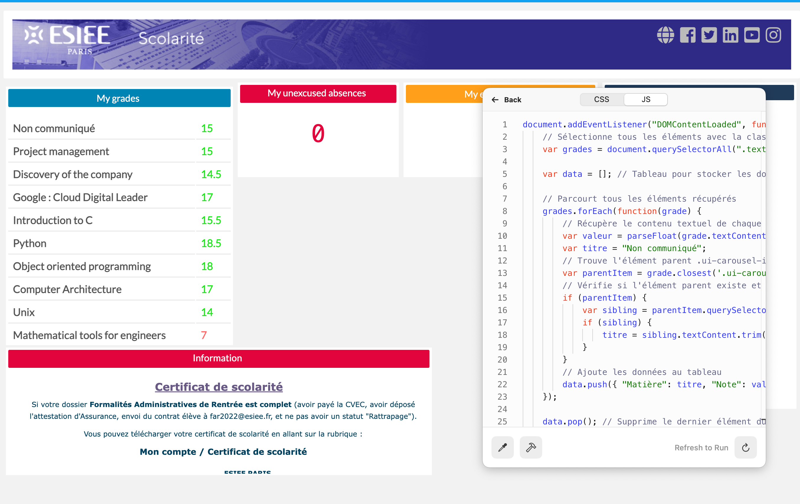

# SMGrades

SMGrades est un boost qui améliore l'affichage des notes en les présentant dans un tableau clair et lisible, au lieu d'une carrousel difficile à naviguer.

## Description

SMGrades transforme l'affichage des notes en un tableau organisé, facilitant ainsi la lecture et réduisant le nombre d'intéractions nécéssaire.
Cet outil est conçu pour offrir une expérience utilisateur plus agréable et plus efficace pour les étudiants.

## Fonctionnalités

- Affichage des notes sous forme de tableau
- Organisation claire et structurée des informations
- Amélioration de l'expérience utilisateur

## Installation

Pour installer et utiliser SMGrades, vous aurez besoin de Arc ici : https://arc.net/ (sur mac)

note : ***la version Windows étant récente ne dispose pas de la gestion des boosts stables*** pour le moment (ou accès ici https://www.reddit.com/r/ArcBrowser/comments/1ah08kw/comment/krdtrug/?utm_source=share&utm_medium=web3x&utm_name=web3xcss&utm_term=1&utm_content=share_button)

### Requirements

1. Se rendre sur la page [Web](https://webaurion.esiee.fr/#)

2. Appuyez sur Cmd+T et recherchez "**Edit Boost**"

3. La fenêtre d'édition des boosts s'affiche :
   

       
   

4. Mettez le contenu de **boost.css** dans la partie **Code > CSS**

5. Mettez le contenu de **boost.js** dans la partie **Code > JS**

**6. Resultat :**
